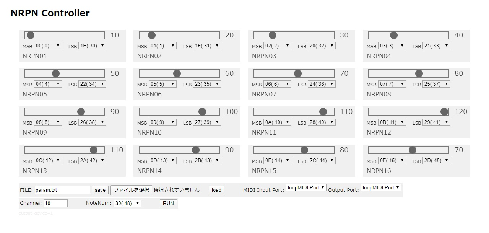
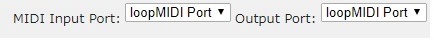
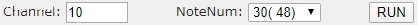
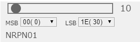
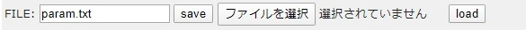

# NRPN-controller



## MIDI PORT



- Please select MIDI **Output Port** by pulldown mane you used.

- **Input Port** is ignored just now.

## Cnanel,and Note Number and RUN



- **RUN :** For checking the NRPN control, send Note On periodically. Note number is define by **NoteNum** box.

## Data Slider and NRPN MSB & LSB



- You can send NRPN Data by a slider knob. 

## Setting Save and Load



- You can save/load configuration of this page.

- The format of the configuration file is below. So you can modify the configuration.

  ```
  __start__
  3,20				/* MIDI Channel/Note Number */
  10,0,10,0,NRPN1		/* MSB/LSB/Data H/Data L/Name */
  11,1,20,0,NRPN2
  12,2,30,0,NRPN3
  13,3,40,0,NRPN4
  14,4,50,0,NRPN5
  16,5,60,0,NRPN6
  16,6,70,0,NRPN7
  17,7,80,0,NRPN8
  18,8,90,0,NRPN9
  19,9,100,0,NRPN10
  20,10,110,0,NRPN11
  21,11,120,0,NRPN12
  22,12,110,0,NRPN13
  23,13,100,0,NRPN14
  24,14,90,0,NRPN15
  25,15,80,0,NRPN16
  __end__
  
  ```

  


## 